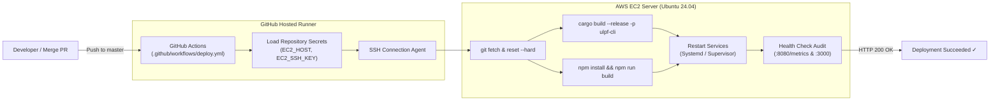

# ULPF Automated CI/CD Deployment Guide (AWS EC2)

This guide documents the automated **Continuous Integration & Continuous Deployment (CI/CD)** pipeline for the canonical Universal Log Pre-processing Framework repository (`guptchar/layaRustparser`).

Whenever pull requests are merged or commits are pushed to the `master` (or `main`) branch, GitHub Actions automatically deploys the latest version to your AWS EC2 instance.

---

## 1. How It Works (Architecture Overview)



1. **Trigger**: Code lands on `master` in `guptchar/layaRustparser`. (Documentation and image changes are automatically filtered out to prevent redundant builds).
2. **Secure SSH Handshake**: GitHub Actions retrieves the private key from encrypted repository secrets, scans the host key, and establishes an authenticated SSH session.
3. **Automated On-Server Build**: The server pulls the exact commit, compiles the optimized release Rust binary (`ulpf`), and generates the production Next.js frontend bundle.
4. **Zero-Downtime Service Cycling**: The supervisor gracefully restarts the REST API server and Next.js frontend.
5. **Live Loopback Health Audit**: The pipeline queries `http://127.0.0.1:8080/metrics` and `http://127.0.0.1:3000` until both respond with `HTTP 200 OK`.

---

## 2. Setting Up GitHub Repository Secrets

To enable the deployment workflow, the repository administrator must add the following secrets in the canonical repository (`guptchar/layaRustparser`):

1. Navigate to: **`https://github.com/guptchar/layaRustparser/settings/secrets/actions`**
2. Click **"New repository secret"** for each of the following:

| Secret Name | Value Example | Description |
| :--- | :--- | :--- |
| **`EC2_HOST`** | `54.210.12.34` or `ec2-xxx.compute.amazonaws.com` | The public IPv4 address or Elastic IP of your EC2 instance. |
| **`EC2_USER`** | `ubuntu` | The SSH login user (default is `ubuntu` on AWS Ubuntu AMIs). |
| **`EC2_SSH_KEY`** | *(Paste contents of `ulpf-key.pem`)* | The complete private SSH key including `-----BEGIN ... KEY-----` and `-----END ... KEY-----`. |
| **`EC2_PORT`** | `22` *(Optional)* | Custom SSH port if modified; defaults to `22`. |
| **`APP_DIR`** | `/home/ubuntu/layaRustparser` *(Optional)* | Root folder of the cloned repository on EC2; defaults to `$HOME/layaRustparser`. |

---

## 3. Initial One-Time EC2 Server Preparation

If setting up a fresh EC2 instance, ensure Rust, Node.js, and git are installed:

```bash
# 1. Update system packages
sudo apt-get update && sudo apt-get install -y git build-essential pkg-config libssl-dev jq curl

# 2. Install Rust
curl --proto '=https' --tlsv1.2 -sSf https://sh.rustup.rs | sh -s -- -y
source "$HOME/.cargo/env"

# 3. Install Node.js 20 LTS
curl -fsSL https://deb.nodesource.com/setup_20.x | sudo -E bash -
sudo apt-get install -y nodejs

# 4. Clone repository
git clone https://github.com/guptchar/layaRustparser.git /home/ubuntu/layaRustparser
cd /home/ubuntu/layaRustparser

# 5. (Optional, Recommended) Install Systemd Services for Auto-Boot
sudo ./scripts/setup_systemd.sh
```

---

## 4. Triggering Deployments

### Automatic Deployment
Pushing or merging any pull request to the `master` (or `main`) branch will automatically trigger the deployment.

### Manual On-Demand Deployment
You can deploy any branch or trigger a redeployment without pushing code:
1. Go to **Actions** tab in GitHub.
2. Select **"Deploy to EC2"** from the left sidebar.
3. Click **"Run workflow"** &rarr; Select branch `master` &rarr; Click **"Run workflow"**.

---

## 5. Troubleshooting & Log Inspection

If a deployment fails the health check or encounters an issue, inspect the logs directly on your EC2 instance:

```bash
# If using Systemd:
sudo journalctl -u ulpf-backend.service -n 50 -f
sudo journalctl -u ulpf-frontend.service -n 50 -f

# If running as daemon:
tail -n 50 /home/ubuntu/layaRustparser/serve.log
tail -n 50 /home/ubuntu/layaRustparser/frontend.log

# Manual test run:
cd /home/ubuntu/layaRustparser
./scripts/deploy_ec2.sh
```
